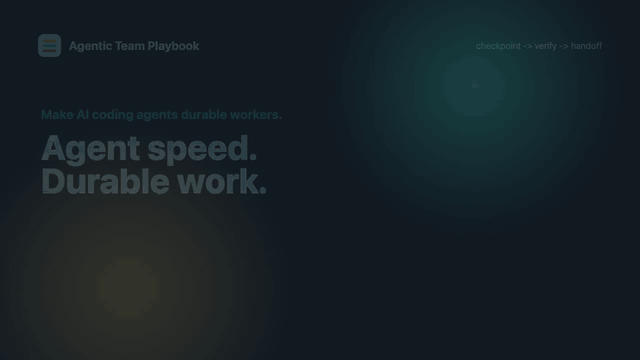

# Agentic Team Playbook

Reusable operating instructions, templates, and checklists for building durable AI coding agents.

The goal is simple: turn fast agent output into reviewable, reversible, verifiable software work.

Durable workers do not just run quickly. They checkpoint state, retry safely, log what happened, and stop before destructive operations. This playbook brings that discipline to agentic programmers: branches as execution contexts, atomic commits as checkpoints, review packs as logs, verification as health checks, and human approval as the circuit breaker for risky work.

Live docs: [agent-playbook.rogerchappel.com](http://agent-playbook.rogerchappel.com/)

<p align="center">
  <a href="public/media/agentic-team-playbook-intro.mp4">
    
  </a>
</p>

## What This Provides

- A global agent operating policy
- A repo-level `AGENTS.md` template
- Review pack and blocker templates
- Risk escalation checklist
- Verification checklist
- Pull request template
- Example `AGENTS.md` files for production, open-source, and internal tooling repos

## Durable Agent Model

- Branches are isolated execution contexts.
- Atomic commits are checkpoints.
- Verification is the health check before handoff.
- Review packs are execution logs.
- Rollback plans are recovery paths.
- Risk escalation is the circuit breaker.
- Pull requests are the human review boundary.

## Who This Is For

Use this if you run agents across:

- production SaaS
- company/client repos
- community OSS
- internal tools
- data pipelines
- mobile/web apps
- AI and automation systems

## Quick Start

Install the shared repo instructions and PR template from your repo root:

```bash
curl -fsSL https://raw.githubusercontent.com/rogerchappel/agentic-team-playbook/main/templates/AGENTS.md -o AGENTS.md
mkdir -p .github
curl -fsSL https://raw.githubusercontent.com/rogerchappel/agentic-team-playbook/main/.github/pull_request_template.md -o .github/pull_request_template.md
```

Then edit:

- repo purpose
- repo type
- layout
- commands
- stop-before-touching list
- verification requirements

## Agent Runtime Setup

Use `AGENTS.md` as the portable source of truth, then add the small adapter file your runtime expects.

### Codex

Repo-level Codex instructions:

```bash
curl -fsSL https://raw.githubusercontent.com/rogerchappel/agentic-team-playbook/main/templates/AGENTS.md -o AGENTS.md
```

Global Codex baseline:

```bash
mkdir -p ~/.codex
curl -fsSL https://raw.githubusercontent.com/rogerchappel/agentic-team-playbook/main/docs/global-agent-operating-policy.md -o ~/.codex/AGENTS.md
```

### Claude Code

Claude Code reads `CLAUDE.md`. Keep it short and point it at `AGENTS.md`:

```bash
curl -fsSL https://raw.githubusercontent.com/rogerchappel/agentic-team-playbook/main/templates/AGENTS.md -o AGENTS.md
cat > CLAUDE.md <<'EOF'
# Claude Code Instructions

Follow AGENTS.md first. It defines the branch-first workflow, atomic commit policy, risk escalation rules, verification requirement, and review pack format for this repository.
EOF
```

### OpenCode

OpenCode can use `AGENTS.md` directly:

```bash
curl -fsSL https://raw.githubusercontent.com/rogerchappel/agentic-team-playbook/main/templates/AGENTS.md -o AGENTS.md
```

### Gemini CLI

Gemini CLI uses `GEMINI.md`. Keep `AGENTS.md` as the shared policy and point Gemini at it:

```bash
curl -fsSL https://raw.githubusercontent.com/rogerchappel/agentic-team-playbook/main/templates/AGENTS.md -o AGENTS.md
cat > GEMINI.md <<'EOF'
# Gemini CLI Instructions

Follow AGENTS.md first. It defines the branch-first workflow, atomic commit policy, risk escalation rules, verification requirement, and review pack format for this repository.
EOF
```

## Core Workflow

Before editing, agents should report:

1. objective
2. expected blast radius
3. files likely to change
4. commit plan
5. verification plan
6. risk level

Then:

1. branch from latest `main`
2. make the smallest coherent change
3. review `git status`
4. review `git diff`
5. stage only intended files
6. run the smallest relevant verification
7. commit atomically
8. rebase before PR
9. open a well-described PR
10. return a review pack

## Principles

- One commit equals one reviewable intent.
- Verification is required before claiming success.
- Risky production areas require human approval.
- PRs should be small enough to review.
- Agents should stop guessing when blocked.
- Do not merge production or community work without human approval.

## Templates

- [Global policy](docs/global-agent-operating-policy.md)
- [Repo AGENTS.md template](templates/AGENTS.md)
- [Review pack template](templates/review-pack.md)
- [Blocker template](templates/blocker.md)
- [PR template](templates/pull_request_template.md)

## Checklists

- [Risk escalation](docs/risk-escalation.md)
- [Verification](docs/verification.md)
- [Atomic commits](docs/atomic-commits.md)
- [Operating a high-throughput agentic team](docs/high-throughput-agentic-team.md)

## License

MIT
